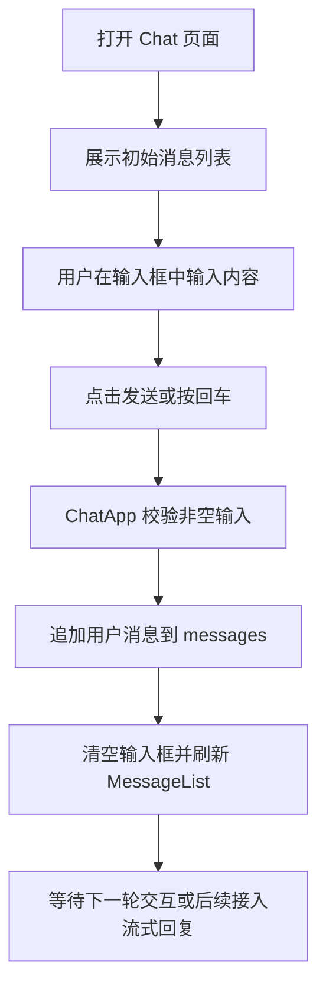

## 1. 产品概述
本阶段目标是在 `apps/web` 中实现一个最小可用的 Chat UI，作为后续“前后端打通 + 流式对话”的前端基础。
- 先完成消息展示、输入发送、容器编排三部分，状态管理仅使用 React `useState`
- 为下一阶段接入后端流式接口保留清晰的数据结构与组件边界，避免当前实现过度设计

## 2. 核心功能

### 2.1 功能模块
1. **ChatApp**：页面级入口，持有消息状态、输入提交逻辑与整体布局
2. **MessageList**：渲染消息列表，区分用户消息与助手消息
3. **InputBox**：输入框、发送按钮、回车发送
4. **ChatContainer**：聊天区域容器，负责头部、消息区、输入区的视觉编排

### 2.2 页面详情
| 页面名称 | 模块名称 | 功能说明 |
|---------|---------|---------|
| Chat 首页 | ChatApp | 初始化演示消息、管理 `messages` 状态、处理发送动作 |
| Chat 首页 | MessageList | 根据消息角色渲染气泡，支持空状态或初始欢迎消息 |
| Chat 首页 | InputBox | 支持文本输入、禁用空发送、点击按钮或按回车发送 |
| Chat 首页 | ChatContainer | 提供页面主布局与聊天卡片容器，保证桌面端优先显示效果 |

## 3. 核心流程
用户打开页面后可看到一组初始消息与输入区；输入内容后点击发送或按回车，新消息立即追加到列表中，并清空输入框。当前阶段不真正请求后端，但消息结构需兼容后续“助手流式增量更新”。

## 4. 用户界面设计
### 4.1 设计风格
- 主色：深色中性背景，辅以冷色高亮，突出“对话工作台”氛围
- 按钮风格：圆角矩形，轻微悬停反馈
- 字体：系统无衬线字体，保证开发阶段稳定性与可读性
- 布局风格：桌面优先的居中聊天卡片，消息区固定高度并内部滚动
- 图标风格：本阶段可不强依赖图标，以文本层级和留白建立信息结构

### 4.2 页面设计概览
| 页面名称 | 模块名称 | UI 元素 |
|---------|---------|---------|
| Chat 首页 | 页面背景 | 简洁深色背景，突出中央聊天容器 |
| Chat 首页 | ChatContainer | 顶部标题、说明文案、消息面板、底部输入区 |
| Chat 首页 | MessageList | 左右分布的消息气泡、角色标签或颜色区分 |
| Chat 首页 | InputBox | 多行输入框、发送按钮、输入辅助提示 |

### 4.3 响应式
采用桌面优先设计，在窄屏下缩小边距和容器高度，保证输入区始终可见。
