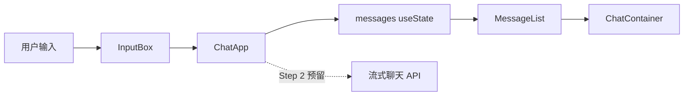
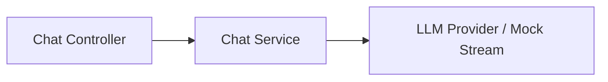
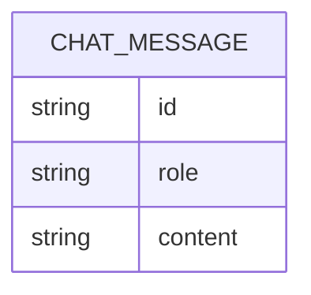

## 1. 架构设计
Step 1 仅实现前端最小闭环，不引入真实后端服务；但在组件职责和消息数据结构上，为 Step 2 的流式接口接入预留扩展点。



## 2. 技术说明
- 前端：React 19 + TypeScript + Vite
- 样式：CSS Modules 暂不引入，沿用当前项目的全局 `App.css` 与 `index.css`
- 状态管理：React `useState`
- 初始化方式：复用现有 `apps/web` 工程，不新增复杂状态库或数据请求层

## 3. 路由定义
| 路由 | 用途 |
|------|------|
| / | 最小 Chat UI 展示页 |

## 4. API 定义（为 Step 2 预留）
本阶段不接真实后端，但前端消息结构按后续流式返回设计。

```ts
type MessageRole = 'user' | 'assistant'

interface ChatMessage {
  id: string
  role: MessageRole
  content: string
}

interface ChatRequest {
  message: string
}

interface StreamChunk {
  delta: string
  done: boolean
}
```

预留接口约定：
- `POST /api/chat`
- 请求体：`ChatRequest`
- 返回方式：后续使用流式文本分片，前端按 `delta` 逐步拼接到最后一条 assistant 消息

## 5. 服务端架构图（Step 2 预留）


## 6. 数据模型
### 6.1 数据模型定义


### 6.2 数据定义说明
本阶段消息仅保存在前端内存中，不创建数据库表。若后续需要持久化，可按如下字段扩展：
- `id`：消息唯一标识
- `role`：`user` 或 `assistant`
- `content`：消息文本内容
- `createdAt`：消息创建时间

## 7. 实现约束
1. 组件拆分保持简单清晰，仅包含 `ChatApp`、`MessageList`、`InputBox`、`ChatContainer`
2. 组件职责单一，避免在 Step 1 引入 hooks、context、zustand 或请求封装层
3. `ChatApp` 统一持有消息状态并通过 props 向下传递
4. 发送逻辑先做本地追加，后续接流式接口时仅替换提交逻辑，不推翻组件结构
